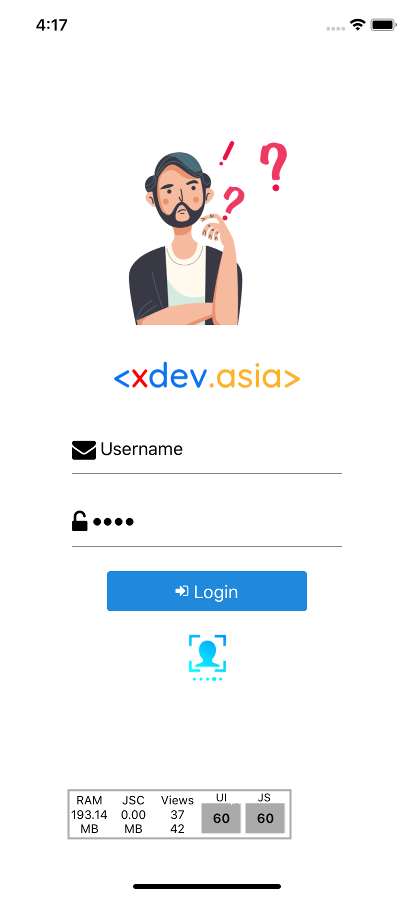

# How to run Project

git clone git@github.com:duydev1994/react-native-redux-saga-flux-router-starter.git ProjectName

npm install

npm run ios

# Compoent using

[UI using component](https://react-native-elements.github.io/react-native-elements/docs/overview.html)

Project incluted

    "@react-native-community/async-storage": "^1.11.0"
    "@react-native-community/masked-view": "^0.1.10"
    "@react-navigation/native": "^5.5.1"
    "react": "16.11.0",
    "react-native": "0.62.2",
    "react-native-gesture-handler": "^1.6.1"
    "react-native-navbar": "^2.1.0"
    "react-native-reanimated": "^1.9.0"
    "react-native-router-flux": "^4.2.0"
    "react-native-safe-area-context": "^3.0.6"
    "react-native-screens": "^2.9.0"
    "react-native-vector-icons": "^6.6.0"
    "react-redux": "^7.2.0"
    "redux-logger": "^2.6.1"
    "redux-saga": "^1.1.3"
    "redux-storage": "^4.1.2"
    "redux-storage-engine-reactnativeasyncstorage": "^1.0.7"
    "remote-redux-devtools": "^0.5.16"

# DEMO

